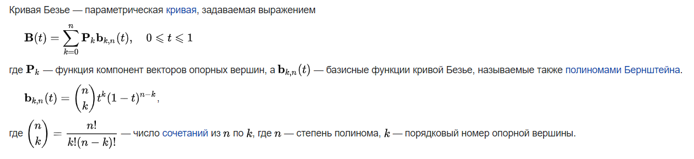

# Кривые безье

Кривые Безье интересная штука, её используют для отрисовки шрифтов.
Так же эти кривые и их собратья плоскости популярны в CAD системах, не меньшей популярностью там пользуются NURBS (Неоднородные рациональные B-сплайны).

На википедии дано определение кривой безье.



Думаю, если вы такой же математик, как из меня танцор диско, то вам будет слегка сложновато понять это все с первого раза.

К счастью для таких незамысловатых математиков как я, Поль де Кастельжо придумал рекурсивный алгоритм.


Код я буду приводить на C++, но вы не пугайтесь, я написал код так, что даже без знания плюсов, но со знанием любого С-подобного языка вы поймете о чем речь. Единственное уточнение. `point_t` - специальный класс точки для которого определены арифметические операторы, по сути аналог одномерных массивов из numpy.

Для начала посмотрим как можно построить кривую для двух опорных точек. В данном случае кривая представляет собой отрезок прямой линии, опорные точки `first` и `second` определяют его начало и конец.

```C++
point_t bezier_two_points(point_t first, point_t second, double t) {
    return (1-t)*first + t*second;
};
```

Чтобы построить кривую нужно просто посчитать достаточно много точек, но тут есть нюанс, если взять шаг слишком большим то кривая может получиться не совсем кривой, скорее ломаной, но оставим эту проблему для разработчиков cad систем. Давайте просто возьмем достаточно малый шаг.

```C++
std::vector<point_t> bezier_line(std::vector<point_t> control_points) {
    double dt = .00001;
    double t_start = 0, t_end = 1;
    std::vector<point_t> res;
    res.reserve(std::size_t(t_end / dt));
    for (auto t = t_start; (t_end - t) > dt; t += dt) {
        auto point = bezier_two_points(control_points[0], control_points[1], t);
        res.push_back(point);
    }
    return res;
}
```

```C++
point_t bezier(std::vector<point_t> points, double t) {

    while(points.size() > 1) {
        for (vector_points::size_type i = 0; i < points.size()-1; i++) {
            points[i] = bezier_two_points(points[i], points[i+1], t);
        }
        points.pop_back();
    }
    
    return points.back();
```

Эта функция принимает два аргумента 
1. Массив опорных точек
1. Параметр $inline$t\in [0,1]$inline$

\- Стоп, а если можно построить кривую, то можно ли построить плоскость? \
\- Да, можно.

