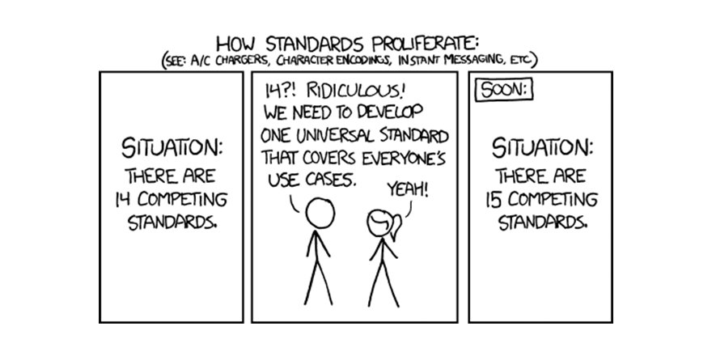
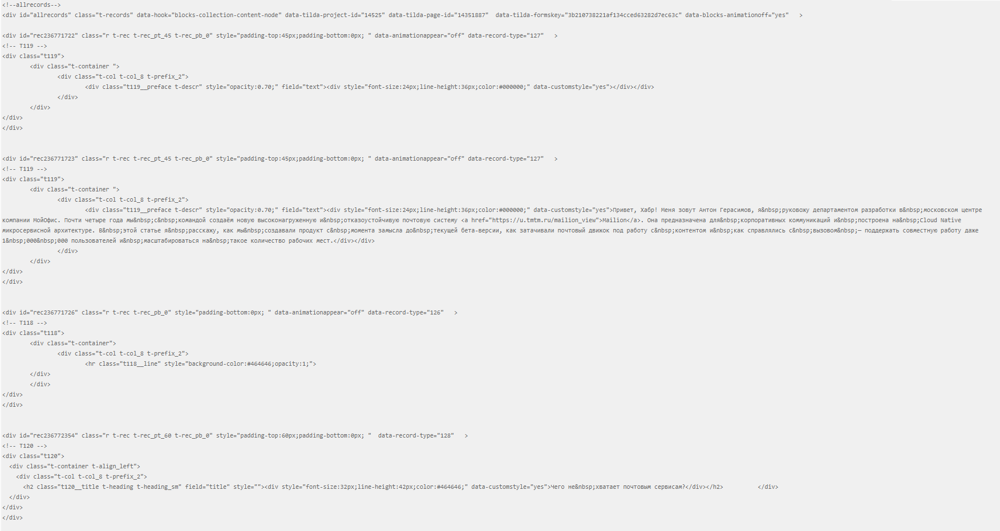

# html2json

Как обычно мы храним в базе данных когда что-то нужно показать пользователю что обладает некоторомы свойствами разметки? Кто хотя бы раз делал свой блог, хабр или похожее сразу скажет - html. А что если я скажу, что можно сделать иначе? JSON.

Я бы хотел рассмотреть преимущества и недостатки подобного хранения, ну или попытаться по крайней мере.



## Что? Json? Зачем это вообще надо?

**Описани:**

У нас имеется сервис, в бд мы храним html для отображения некоторого контента. 

Если я не ошибаюсь, то так как раз сделано на всем нами любимом или несильно - хабре. \
*(Я посмел предположить, что хабр хранит статьи именно так)*

**Проблема:**

Мы, как фронтендеры, должны поддерживать на клиенте некоторый набор легаси css или как то тяжело его обновлять.
Если наш фронтендер захочет как то обновить наш UI, то он должен учитывать, что на сервере весь html в бд содержит старые классы css и волшебным образом не поменяется и скорее всего вообще меняться не будет.

Можно, например, посмотреть что выдается для мобильной версии фронтенда хабра под недавним мегапостом [ссылка на апи](https://m.habr.com/kek/v2/articles/522630/). *Конечно, сомнительно (возможно очень), что пост хранится прям в таком виде в бд, но все может быть. (возможно, это связанно с тем что апи хабра до сих пор не открыто)*

***Внимание:*** ~~Не~~большой скрин просьба спрятать женщин, детей и слишком чувствительных гиков:



Некоторое количество заинлайненого css и javascript (около половины поста генерируется им) осталось за кадром.

**Решение:**

Будем **хранить** не html а json, с определенной заранее или легко расширяемой структурой, что бы каждый элемент имел четкую структуру и был далек от представления у фронтендера.

**Профит который получим:**

Мы полностью абстрагировались от представления данных и сконцентрировались лишь на содержимом. Благодаря этому мы в любой момент сможем с достаточной простотой обновить код преобразования (или рендер) json в html который мы отдаем в браузер. Только теперь мы сможем написать похожий рендер из json'а не только в html, но и для нативных приложений без необходимости использовать Web View и аналоги.

## Рассмотрим идею на примерах

Для этого предлагаю ознакомится с тем что выдает по api хабр (только уже без мега постов) \
Важно: я предполагаю что статьи хранятся в том же виде в каком и отправляются.

Показывать я будут сначала html, а потом альтернативу в виде json.

Изображение с подписью: источник: https://habr.com/ru/company/tuturu/blog/526710/
```html
<br>
<sup> Хотя пеликан, конечно, улетит. Пеликаны они вообще такие. </sup><br>
```

```json
{
    "type": "image",
    "src": "https://habrastorage.org/webt/nz/2t/p3/nz2tp3ywl9fdr7quadxm1dzmhdo.jpeg",
    "caption": "Хотя пеликан, конечно, улетит. Пеликаны они вообще такие."
}
```

<br/>

Изображение с подписью: источник: https://habr.com/ru/post/526676/
```html
<br>
<i>Макет пункта захоронения ЖРО на одном из трех подобных российских объектов.</i><br>
```

```json
{
    "type": "image",
    "src": "https://habrastorage.org/webt/lr/ql/v9/lrqlv9u6cxmuoyn-0hgrik3z0aw.jpeg",
    "caption": "Макет пункта захоронения ЖРО на одном из трех подобных российских объектов."
}
```

Думаю, что человек который знает про тег `figcaption` начал грустить. А фронтендер который видит подобное многообразие на которое не может или может, но с трудом повлиять еще больше грустит (а может и нет).

Рассмотрим более комплексный пример.

[Оригинал откуда взята часть текста](https://habr.com/ru/post/472070/)

А вот так может например выглядит спойлер (просто напомню, что в html5 давно есть details):

<details>
<summary>Большой кусок кода</summary>

```html
<div class="spoiler" role="button" tabindex="0">
    <b class="spoiler_title">Я приведу список моих документов. Он очень скучный</b>
    <div class="spoiler_text">Итак, нужно было перевести на немецкий:<br />
        <br />
        <ul>
            <li>Мои дипломы (бакалавра и магистра) с приложениями</li>
            <li>Диплом супруги с приложением</li>
            <li>Свидетельство о браке</li>
            <li>Свидетельства о рождении детей</li>
            <li>Трудовую книжку</li>
            <li>Резюме</li>
        </ul><br />
        Перед выполнением перевода нужно не забыть поставить апостиль на «Свидетельство о браке» и «Свидетельства о
        рождении детей». Вот тут-то я понял, почему эти документы нельзя ламинировать.<br />
        <br />
        Также необходимо проверить факт соответствия диплома по базе данных <a
            href="https://anabin.kmk.org/anabin.html" rel="nofollow">Anabin</a>.<br />
        <br />
        Далее нужно было:<br />
        <br />
        <ul>
            <li>Получить приглашение от немецкой компании</li>
            <li>Получить копию трудового договора со стороны компании. В моем случае оригинал с «мокрой» печатью и
                подписями не понадобился</li>
            <li>Оформить медицинскую страховку</li>
            <li>Подписать бумагу о том, что являешься цивилизованным человеком и в курсе, как вести себя в Германии
            </li>
            <li> заполнить <a
                    href="https://germania.diplo.de/ru-ru/service/05-VisaEinreise/langfristigerAufenthalt/-/1611410?openAccordionId=item-1611410-3-panel"
                    rel="nofollow">анкету </a>на получение национальной визы </li>
            <li>Взять гражданский и заграничный паспорт с копиями</li>
            <li>Сфотографироваться на визу</li>
        </ul><br />
        Разумеется, все документы должны оформляться на немецком языке.<br />
        <br />
        Интересный нюанс: есть несоответствие информации на сайте <a href="https://germania.diplo.de/ru-ru"
            rel="nofollow">представительства Германии в России</a> и реальных требований. А именно: сертификат,
        подтверждающий знания немецкого языка предоставлять не нужно. Кроме того, не нужно иметь договор аренды
        жилья в Германии, хотя этот пункт присутствует в анкете. Напомню, это не нужно если вам открывают рабочую
        визу с последующим оформлением «blue card», но если вы переезжаете по-другому алгоритму — и документы также
        могут потребоваться другие.<br />
        <br />
        В немецком посольстве все были предельно вежливыми, белыми и пушистыми.<br />
        <br />
        Однако, но из-за какой-то внутренней ошибки они чуть было не выдали мне рабочую визу на 3 месяца вместо 6-и.
        Так что доверяй, но проверяй!<br />
        <br />
        Да, немцы тоже косячат. <br />
    </div>
</div>
```

Иииии.... преобразуем это в json:

```json
{
    "type": "details",
    "title": "Я приведу список моих документов. Он очень скучный",
    "child": {
        "type": "div",
        "children": [
            {
                "type": "tp",
                "text": "Итак, нужно было перевести на немецкий:"
            },
            {
                "type": "unordered_list",
                "children": [
                    {
                        "type": "tp",
                        "text": "Мои дипломы (бакалавра и магистра) с приложениями"
                    },
                    {
                        "type": "tp",
                        "text": "Диплом супруги с приложением"
                    },
                    {
                        "type": "tp",
                        "text": "Свидетельство о браке"
                    },
                    {
                        "type": "tp",
                        "text": "Свидетельства о рождении детей"
                    },
                    {
                        "type": "tp",
                        "text": "Трудовую книжку"
                    },
                    {
                        "type": "tp",
                        "text": "Резюме"
                    }
                ]
            },
            {
                "type": "tp",
                "text": "Перед выполнением перевода нужно не забыть поставить апостиль на «Свидетельство о браке» и «Свидетельства о рождении детей». Вот тут-то я понял, почему эти документы нельзя ламинировать."
            },
            {
                "type": "paragraph",
                "children": [
                    {
                        "type": "span",
                        "text": "Также необходимо проверить факт соответствия диплома по базе данных",
                        "mode": []
                    },
                    {
                        "type": "link_span",
                        "text": "Anabin",
                        "src": "https://anabin.kmk.org/anabin.html"
                    },
                    {
                        "type": "span",
                        "text": ".",
                        "mode": []
                    }
                ]
            },
            {
                "type": "tp",
                "text": "Далее нужно было:"
            },
            {
                "type": "unordered_list",
                "children": [
                    {
                        "type": "tp",
                        "text": "Получить приглашение от немецкой компании"
                    },
                    {
                        "type": "tp",
                        "text": "Получить копию трудового договора со стороны компании. В моем случае оригинал с «мокрой» печатью и подписями не понадобился"
                    },
                    {
                        "type": "tp",
                        "text": "Оформить медицинскую страховку"
                    },
                    {
                        "type": "tp",
                        "text": "Подписать бумагу о том, что являешься цивилизованным человеком и в курсе, как вести себя в Германии"
                    },
                    {
                        "type": "paragraph",
                        "children": [
                            {
                                "type": "span",
                                "text": "заполнить",
                                "mode": []
                            },
                            {
                                "type": "link_span",
                                "text": "анкету ",
                                "src": "https://germania.diplo.de/ru-ru/service/05-VisaEinreise/langfristigerAufenthalt/-/1611410?openAccordionId=item-1611410-3-panel"
                            },
                            {
                                "type": "span",
                                "text": "на получение национальной визы",
                                "mode": []
                            }
                        ]
                    },
                    {
                        "type": "tp",
                        "text": "Взять гражданский и заграничный паспорт с копиями"
                    },
                    {
                        "type": "tp",
                        "text": "Сфотографироваться на визу"
                    }
                ]
            },
            {
                "type": "tp",
                "text": "Разумеется, все документы должны оформляться на немецком языке."
            },
            {
                "type": "paragraph",
                "children": [
                    {
                        "type": "span",
                        "text": "Интересный нюанс: есть несоответствие информации на сайте",
                        "mode": []
                    },
                    {
                        "type": "link_span",
                        "text": "представительства Германии в России",
                        "src": "https://germania.diplo.de/ru-ru"
                    },
                    {
                        "type": "span",
                        "text": "и реальных требований. А именно: сертификат, подтверждающий знания немецкого языка предоставлять не нужно. Кроме того, не нужно иметь договор аренды жилья в Германии, хотя этот пункт присутствует в анкете. Напомню, это не нужно если вам открывают рабочую визу с последующим оформлением «blue card», но если вы переезжаете по-другому алгоритму — и документы также могут потребоваться другие.",
                        "mode": []
                    }
                ]
            },
            {
                "type": "tp",
                "text": "В немецком посольстве все были предельно вежливыми, белыми и пушистыми."
            },
            {
                "type": "tp",
                "text": "Однако, но из-за какой-то внутренней ошибки они чуть было не выдали мне рабочую визу на 3 месяца вместо 6-и. Так что доверяй, но проверяй!"
            },
            {
                "type": "tp",
                "text": "Да, немцы тоже косячат."
            }
        ]
    }
}
```

</details></br>

Вообще, Html очень удобен что бы представлять просто текст.
Только взгляните на этого монстра:

```json
{
    "type": "paragraph",
    "children": [
        {
            "type": "span",
            "text": "Также необходимо проверить факт соответствия диплома по базе данных",
            "mode": []
        },
        {
            "type": "link_span",
            "text": "Anabin",
            "src": "https://anabin.kmk.org/anabin.html"
        },
        {
            "type": "span",
            "text": ".",
            "mode": []
        }
    ]
}
```
***Примечание:*** `mode` используется для того чтобы представлять такие значения как `bold`, `italic`, `strike` и группировать их, просто пример не очень удачный.

Столько символов чтобы представить один параграф с одной ссылкой.

Удобно ли это? Не уверен, легко можно выяснить какие стили у конкретного `span` без необходимости ходить для поиска предыдущих нод, но, например, в андроид есть стандартный `TextView` который без проблем сработается с простеньким html

Все это я, конечно, переводил не в ручную (кроме некоторых кейсов). Я брал некоторые статьи и прогонял html через свою небольшую консольную утилиту на Dart, её результаты работы  вы и увидели. Да, она написана не идеально, но для проверки концепта - сойдет.

Потыркать утилиту и посмореть код можно по ссылке на мой [репозиторий](https://github.com/avdosev/html2json).

Вообще к чему эти примеры. Ими я хотел сказать, что если заставляете пользователей использовать html для создания статей, то результат становится непредсказуемым, а повлиять на него можно лишь большим усилием и при желании самого пользователя.

## Небольшой бенчмарк

Что я вообще сравниваю? Мне интересно 2 вещи:

1. Есть ли разница в скорости парсинга json с заинлайненым html и json с представленнием статьи в виде json'а.
2. Насколько быстро распарсить два формата вложенных друг в друга.

Зачем тестировать второй вариант? Если вы используете React, например, вместе с библиотекой "html_to_react" (внутри она использует "html-dom-parser"), то думаю вам будет интересно узнать об альтернативе.

Кратко опишу методику тестирования:
* Я заранее перевел с помощью утилиты пару хабровский статей в json.
* Есть три операции которые тестируются
    1. Скрость парсинга статьи без преобразований (статья полнстью в том виде в котором его выдает по апи хабр, в html)
    1. Скорость парсинга если html заменить на преобразованый моей утилитой json
    1. Скорость парсинга когда парсим сначала json а после парсим html внутри. 
* тестируем библиотеку только для построения dom дерева, замеры для "html_to_react" не проводились

Код бенчмарка:

```js
import Benchmark from "benchmark";
import fs from 'fs';
import htmlToDOM from 'html-dom-parser';

function parse(str) {
    return JSON.parse(str);
}

function prepareAndParse(str) {
    return htmlToDOM(JSON.parse(str)["textHtml"]);
}

const suiteName = '526574'
const defaultHtml = fs.readFileSync(`./test_data/${suiteName}/html.json`);
const jHtml = fs.readFileSync(`./test_data/${suiteName}/jhtml.json`);

const suite = new Benchmark.Suite;

suite.add('Json c html2json', () => parse(jHtml))
suite.add('Html в json', () => parse(defaultHtml))
suite.add('Html в json и парсинг html-dom-parser', () => prepareAndParse(defaultHtml))

suite.on('complete', function() {
    console.log('Fastest is ' + this.filter('fastest').map('name'));
}).on('cycle', function(event) {
    console.log(String(event.target));
})

suite.run()
```

**Результаты тестирования**

После запуска бенчмарка мы получим такие результаты:

```
Json c html2json x 1,892 ops/sec ±0.79% (88 runs sampled)
Html в json x 1,917 ops/sec ±0.81% (89 runs sampled)
Html в json и парсинг html-dom-parser x 798 ops/sec ±3.04% (86 runs sampled)
```

1. Скорость парсинга статьи полностью из json'а и с html внутри json'а по производительности не имеет значительной разницы.
2. Производительность при двух проходах парсинга (сначала парсим json, а потом html) примерно в 2 раза меньше и не в пользу html.

## Ок, а какие плюсы и минусы подобного решения?

плюсы:
1. Сделав подобное преобразование на сервере, в некоторых ситуациях можно немного ослабить нагрузку на гаджет пользователя
1. Независимость от html
    
    Мы устраняем зависимость от того как хотим представлять на клиенте кнопку или спойлер, или цитату. независимы от css классов от различных атрибутов.

    Мы получаем возможность безболезненно создать на основе данных с сервера нативные виджеты, будь то андроид, ios, flutter, web или что-то из мира десктопа.

    И это все без WebView и аналогов.

1. Избавляемся от зависимостей

минусы:
1. json весит незначительно, но больше чем аналогичный html 
    
    возможно и обратное, если:
    * у вас более сложная структура, которая лучше поддается оптимизации 
    * вы захотите использовать бинарный формат для представления вашего json (забавно - bson оказался в моем случае даже больше чем стандартный json), тогда получится сократить размер, но опять же это достаточно трудоемко, а фичи не ждут.

1. json придется в любом случае конвертировать в нативные для данной платформы виджеты будь то веб с его html или нативный мир уже с собственными особенностями

    И при этом не очень понятно когда это лучше делать в случае веб-приложений:
    * Можно конвертировать прямо на клиенте, что удобно в случае если вы используете кастомные виджеты.
    * Можно конвертировать на сервере, а на фронтенд отправлять уже все готовое.
    
1. html очень многогранный и если есть необходимость поддерживать весь html то, на мой взгляд, затея выглядит достаточно сомнительной и трудоемкой (не придешь ли ты случайно к тому что изобретешь браузер)
1. отсутвует стандартизация, получается, что вы создаете велосипед и поддерживать его придется вам

## Это все конечно хорошо, но как можно это применить?

Вот мой небольшой список:

1. Создание платформо-независимого генерируемого в рантайме ui
1. Отказ от редакторов использующих html, написать собственный редактор получится проще и скорее всего он будет безопаснее т.к. встроить зловредный javascript будет сложнее
1. Думаю, можно продолжать дальше, но я больше ничего не смог придумать, надеюсь читатели помогут и предложат еще вариантов.

## Заключение

В качестве итога я бы хотел сказать, что не предлагаю всем разом переходить на описанный мной в данной статье подход. В первую очередь мне интересно мнение других разработчиков, как бекенд так и фронтенд. Скорее всего, я не учел нюансы и готов выслушать и обсудить критику и замечания.